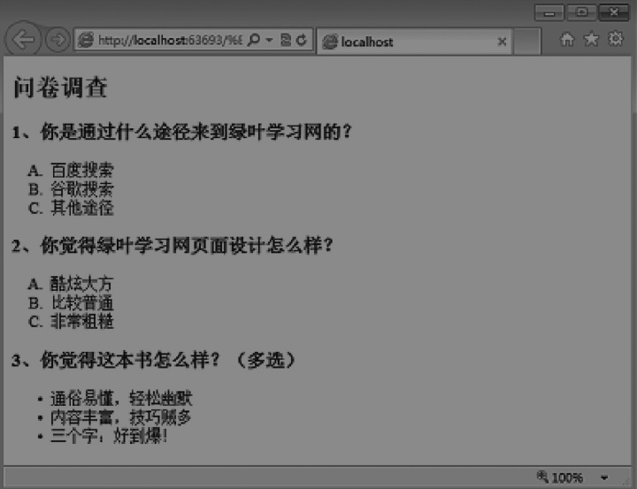

## 列表
三种: 有序列表、无序列表、定义列表;

实际开发中一般用无序列表

### 有序列表

- 标签: `<ol>...</ol>`
  - ordered list
- 一般采用数字或者字母作为顺序
- 默认用数字数序

[示例代码](../list_tag/ol_intro.html)

#### type 属性

type属性可以改变列表项符号，默认用数字；

**属性值**

- 1: 数字
- a: 小写英文字母
- A: 大写英文字母
- i: 小写罗马数字
- I: 大写罗马数字

### 无序列表

默认情况下，无序列表的列表项符号是●，不过可以通过type属性来改变

- 标签: `<ul>...</ul>`
  - unordered list
- type 属性
    - disc: 实心圆(默认)
    - circle: 空心圆
    - square: 正方形
- [示例代码](../list_tag/ul_intro.html)

#### 注意

- ul元素的子元素只能是li元素，不能是其他元素
- 文本不能直接放在ul元素内

### 定义列表
组成: 名词和描述

**语法:**
```
<dl>
    <dt>name<dt>
    <dd>description</dd>
    ...
</dl>
```

- dl: definition list
- dt: definition term
- dd: definition description
- [示例代码](../list_tag/dl_intro.html)

实际开发中，定义列表用的表较少。

### HTML语义化

能用某一个学过的标签来代替，就懒得认真学新的标签。这就是HTML学习中最大的误区。
我们学习HTML并不是看自己学了多少标签，更重要的是在你需要的地方能否用到恰当的语义化标签。把标签用在对的地方，这才是学习HTML的目的所在。

语义化对于搜索引擎优化（即SEO）来说，也是极其重要的。

### 编程题
要求：大标题用h1标签；小题目用h3标签；前两个问题使用有序列表；最后一个问题使用无序列表。


