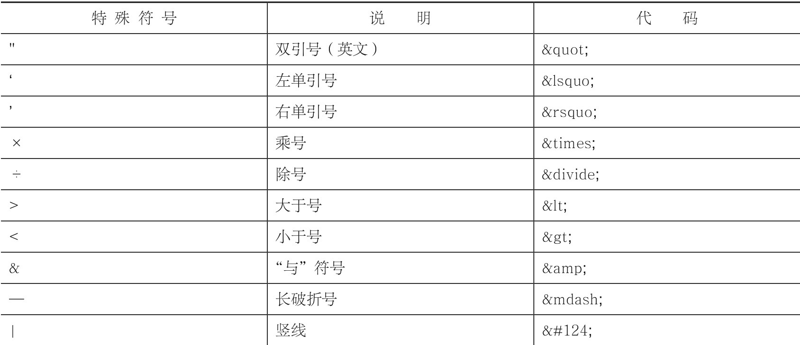
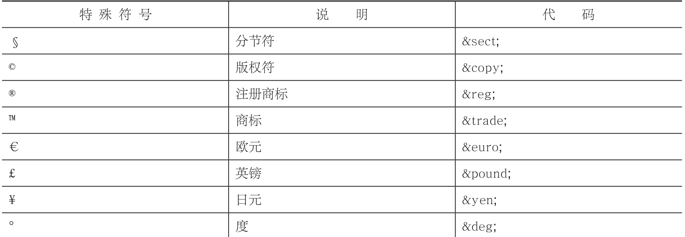
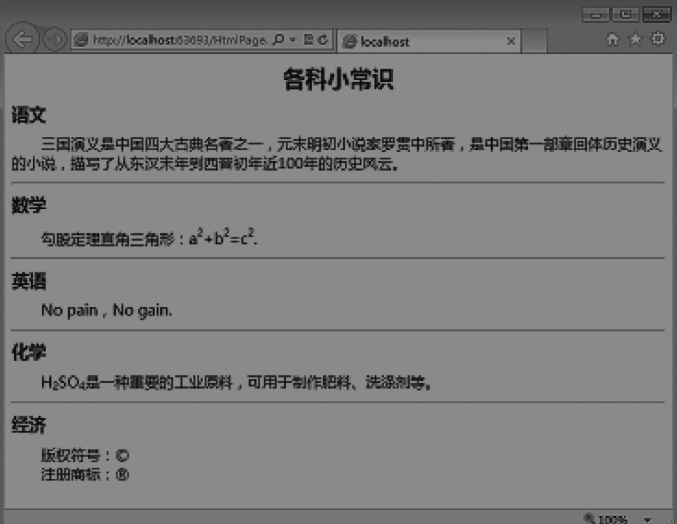

## chapter 4 文本

### 静态页面组成
一个静态页面绝大部分由一下4中元素组成:

- 文字
- 图片
- 超链接
- 音频和视频

### html文本

- 标题标签: h1,h2,h3,h4,h5,h6
  - 一个页面一般只能有一个h1标签，其他级别标签可以有多个
- 段落标签: `
段落内容
`
  - 会自动换行，并且段落之间有一定间距
- 换行标签: ` `
  - break 的缩写
  - 是自动闭合标签
- 文本标签
  - 粗体标签: strong,b
    - 推荐哟个 strong
  - 斜体标签: i,em,cite
    - 推荐用 em
      - emphasized
  - 上标标签: sup
    - superscripted
  - 下标标签: sub
    - subscripted
  - 中划线标签: s
    - strikethrough: 删除线
  - 下划线标签: u
    - 后面学了css，都是用css实现
  - 大字号标签: big
  - 小字号标签: small
  - 水平标签: hr
    - horizon
  - div标签
    - 划分HTML结构，结合css针对该区域进行样式控制
    - 内部可以放所有其他标签  
    - [代码](../div_intro.html)  

#### 自闭合标签

- `<meta/>`
- `
`
- ` `
- `<link/>`
- ``
- `<input/>`

只有开始符号没有结束符号，内部不可以插入其他标签或文字

[代码举例](../text_tag_intro.html)    

#### 块元素和行内元素

- 标签也叫 “元素”
- 根据元素的表现形式，一般可以分为两类:
  - 块元素(block)
  - 行内元素(inline)

##### 块元素

在浏览器显示状态下占据一整行，并排斥其他元素与其位于同一行; 一般情况下内部可以容纳其他块元素和行内元素.

- h1-h6
- p
- div
- hr
- ol: 有序列表
- ul: 无序列表

##### 行内元素  

可以和其他行内元素位于同一行，标签内部只能容纳其它行内元素，不可以容纳块元素.

- strong
- em
- a: 超链接
- span: 结合css定义样式

#### 特殊符号

- 空格: `&nbsp;`
- 特殊符号都有对应的代码
  - 都是以&开头
  - 以;(英文分号)结尾
  - 分成2大类:能通过输入法输入+输入法难以输入

---

#### 练习，把下面的网页效果做出来

