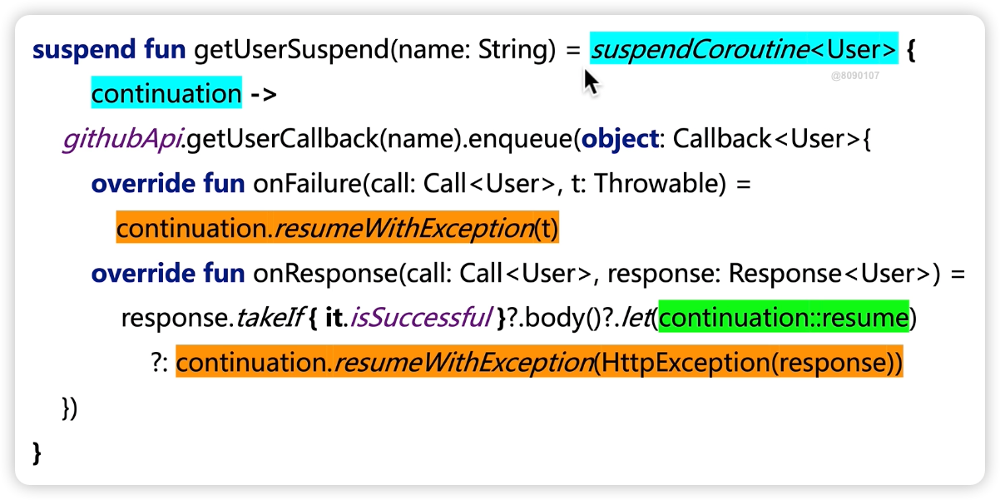
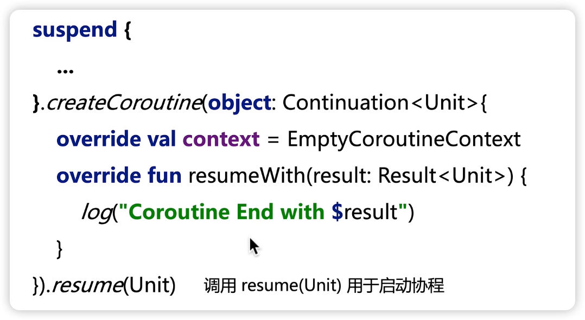
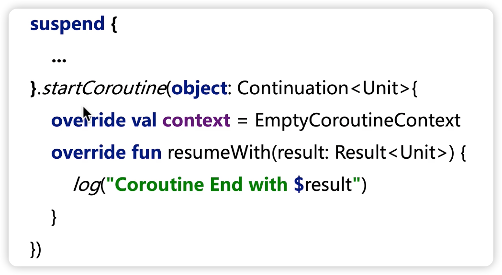

## 协程初步

- [协程是什么](#协程初步)
- [协程的常见实现1](#协程的常见实现1)
- [协程的基本要素](#协程的基本要素)
- [协程的创建](#协程的创建)

### 协程是什么

- 可以由程序自行控制挂起、恢复的程序
- 用来实现多任务多协作执行
- 解决异步任务控制流多灵活转移

#### 协程的作用

- 可以让异步代码同步化
- 降低异步程序的设计复杂度
- 挂起和恢复可以控制执行流程的转移
- 异步逻辑可以用同步代码的形式写出
- 同步代码比异步代码更灵活，更容易实现复杂业务 

#### Thread vs Coroutine

- 协程更轻量化
- 线程：
  - 一个线程正在占用cpu，突然另外一个线程来了，说：时间到了兄弟该我了
  - 通常指操作系统的线程，也称为**内核线程**
- 协程：
  - 一个协程正在占用cpu，自己主动说：我要歇会儿，你来吧
  - 指语言实现的线程，运行在内核线程之上。仅存在于语言的运行时中

#### Kotlin 协程

- Kotlin 标准库
- 协程上下文
- 拦截器
- 挂起函数


### 协程的常见实现1

#### 协程的分类

- 按调用栈
  - 有栈协程: 每个协程会分配单独的调用栈，类似线程的调用栈
  - 无栈协程: 不会分配单独的调用栈，挂起点状态通过闭包或对象保存。 kotlin 中就是这种
- 按调用关系
  - 对称协程: 调度权可以转移给任意协程，协程之间是对等关系
  - 非对称协程: 调度权只能转移给调用自己的协程，协程存在父子关系

#### 常见实现

挂起、恢复

- Python Generator
- Lua Coroutine
- Go routine
- async/await

#### 协程的基本要素

- 挂起函数: 在函数定义前加上 `suspend`
- 挂起点: 挂起函数调用的位置
- 挂起函数只能在其他挂起函数或协程中调用
- Continuation, 类似之前用的 Callback
- resume(value: T)
- resumeWithException(t: Throwable)

##### 挂起函数的类型


- ``suspend() -> Unit``
  ```kotlin
suspend fun foo() {}
  ```
- ``suspend(Int) -> String``
  ```kotlin
   suspend fun bar(a: Int) String {
     return "Hello"
   }
  ```

##### 将回调转写成挂起函数

- 使用 ``suspendCoroutine`` 获取挂起函数的 ``Continuation``
- 回调成功的分支使用 ``Continuation.resume(value)``
- 回调失败的分支使用 ``Continuation.resumeWithException(e)``



##### 协程的创建

```kotlin

import kotlin.coroutines.Continuation

fun <T> (suspend () -> T).createCoroutine(completion: Continuation<T>): Continuation<Unit>


fun <R, T> (suspend R.() -> T).createCoroutine(receiver: R, completion: Continuation<T>): Continuation<Unit>
```

- suspend 函数本身执行需要一个 Continuation 实例在恢复时调用，就是上面的参数: completion
- 返回值 Continuation<Unit> 则是创建出来的写成载体, receiver suspend 函数会被传给该实例作为协程的实际执行体



通常会用下面这种方式，直接启动



