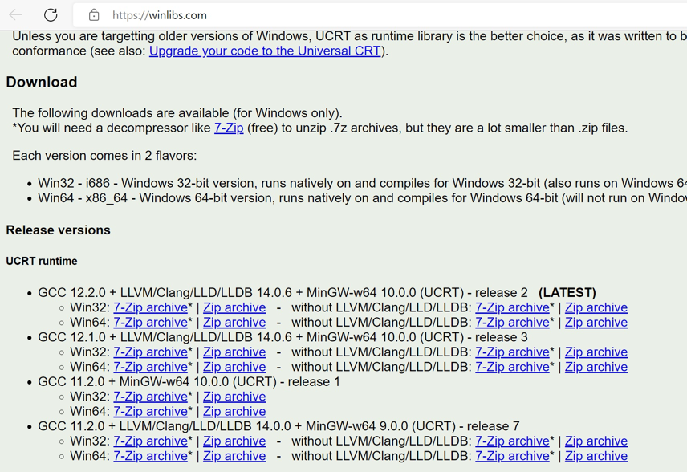
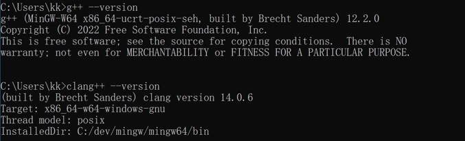

## Chapter1 Setting up the tools

0:04:32 ~ 1:43:01

- [Tools](#Tools)
- [Installing C++ Compilers on Windows](#Windows上安装c++编译器)
- Installing VS Code on Windows
- Configuring Visual Studio Code for C++ on Windows
- Installing C++ Compilers on Linux
- Configuring Visual Studio Code for C++ on Linux
- Installing VS Code on MacOs
- Configuring Visual Studio Code for C++ on MacOs
- Online Compilers

### Tools

- [IDE](#IDEs)
- [Compilers](#Compilers)

#### IDEs

本课程中使用 VS Code(Visual Studio Code)

- Windows
    - Visual Studio Code
    - Microsoft Visual Studio  
    - CodeLite
- Linux
    - Visual Studio Code
    - QT Creator
    - CodeLite
- MacOs
    - Visual Studio Code
    - XCode
    - CodeLite   
    
#### Compilers

课程中通常用 gcc

取决于你用的操作系统：

- Windows
    - Mingw
    - Msvc
    - Clang llvm

- Linux
    - Gcc
    - Clang llvm

- MacOs
    - Gcc
    - Clang Apple
    - Clang llvm
    
### Windows上安装c++编译器

搜索引擎，搜索：WinLibs，打开第一个网页，往下滑动，从这里下载：

下载后，解压，配置环境变量。打开 cmd，使用：

- `g++ --version`
- `clang++ --version` 

