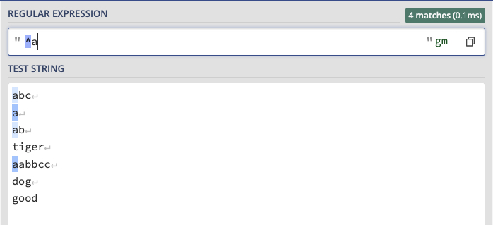
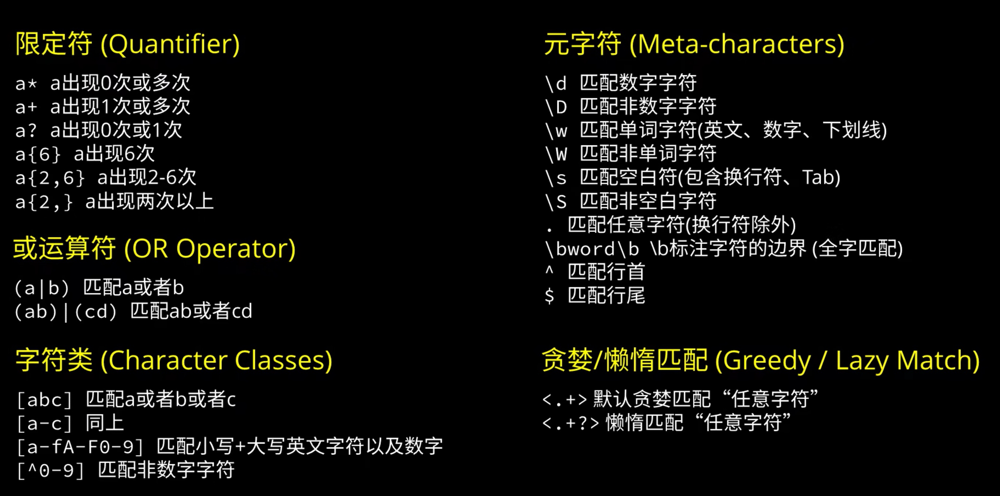

### 正则表达式

[快速入门视频](https://www.bilibili.com/video/BV1da4y1p7iZ?spm_id_from=333.337.search-card.all.click&vd_source=82b7ac2fbd7ece380f983e2c23199d99)

- [在线测试工具](https://regex101.com/)

- 好的教程网站
  - [正则表达式 30分钟入门教程](https://deerchao.cn/tutorials/regex/regex.htm)
  - [github learn-regex](https://github.com/ziishaned/learn-regex/blob/master/translations/README-cn.md)

---

### 限定符

#### 限定符： `？`

- 出现 0 个或 1个

​		**说明：**	`?` 表示该限定符前面的字符（这里是 `d` 出现 0 个或 1个，也就是可有可无。因此匹配了：`use` 和 `used`

#### 限定符 `*`

- 出现 0 次或者多次

​			**说明：**	`*` 表示它前面的字符（这里是 `b`）出现 0 次或者多次。

#### 限定符 `+`

- 匹配一次以上的字符

  

​          **说明：** 表示前面的字符（这里是 `b`）出现一次或者多次

#### 限定符 `{}` 

- 精确匹配范围

  **情况一：**指定出现次数为 6 次：

  

  说明：这里要匹配的是 `b` 字符出现 6 次。

  **情况二：**也可以指定出现次数的范围，如出现 2 ~ 6 次：

  

  **情况三：**出现次数 2次以上

  ​	

#### 匹配多个字符 `()`

- 把要匹配的多个字符放到 `()` 中

  

  说明：匹配字符串 `ab` 出现 1次或多次。

  

  ---

#### 或 运算符 `|`

- 如匹配 a cat 或者 a dog

  

#### 字符类 `[]`

- 方括号里的内容表示要求匹配的字符只能取自于它们

- 如：想匹配由 `abc` 构成的单词，可以用：`[abc]+`

  

- 也可以指定范围
  - 如，指定小写字母：`[a-z]`
  - 指定大写字母：`[A-Z]`
  - 指定所有英文字符：`[a-zA-Z]`
  - 所有数字：`[0-9]`
  - 取反用 `^`，如，所有非数字字符：`[^0-9]`

---

### 元字符

正则表达式预先定义好了常用的字符类型，如：

- `\d` 代表数字字符，等价于 `[0-9]`
- `\w` 代表单词字符（英文、数字及下划线）
- `\s` 代表空白字符（包含 Tab 和换行符）
- `\D` 代表非数字字符
- `\W` 代表非单词字符
- `\S` 代表非空白字符
- `.` 代表任意字符（不包含换行符）

### 特殊字符

- `^` 匹配行首
- `$` 匹配行尾

#### `^` 匹配行首

​    

#### `$` 匹配行尾

   

### 高级概念

- 贪婪与懒惰匹配

#### 贪婪与懒惰匹配（Greedy vs Lazy Match）

 如下，从 html 样式中过滤出标签，如果直接用 `<.+>` 匹配，匹配结果如下：

  全部都匹配上了，因为默认用的是 贪婪匹配。改成懒惰匹配：`<.+?>`

​	

​     就是想要的匹配结果了，只把标签匹配了。

---

### 实例部分

#### 实例 1 （RGB 颜色值匹配）

`#[a-fA-F0-9]{6}\b`

其中 `\b` 代表单词字符的边界

#### 实例 2 IPv4 地址匹配

- `\.` 表示 `.` ，因为直接用 `.` 在正则表达式中是一个特殊字符
- 很麻烦 

### 要点

