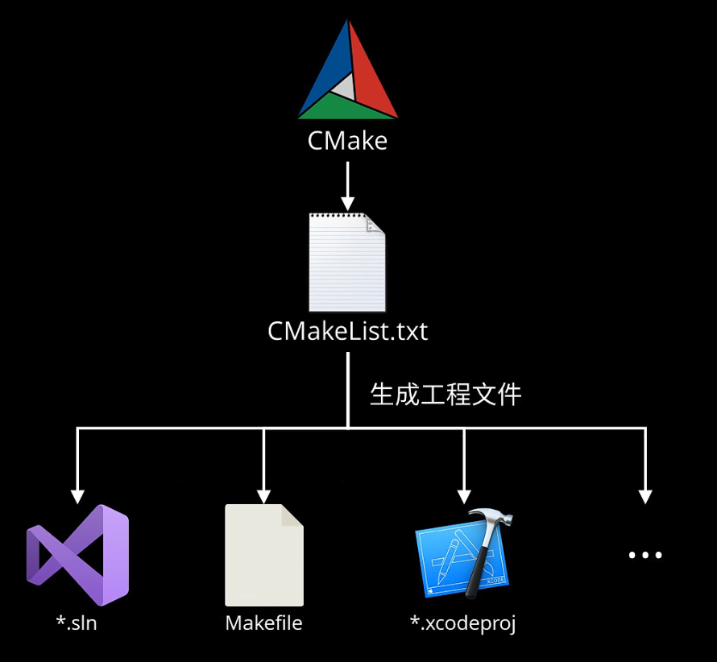

### CMake 入门

[B 站视频](https://www.bilibili.com/video/BV1rR4y1E7n9?spm_id_from=333.1007.top_right_bar_window_history.content.click&vd_source=82b7ac2fbd7ece380f983e2c23199d99)

0. CMake 安装
1. 确保计算机中已经安装了 C++ 编译工具
2. 构建示意图
3. [用 VS Code 构建简单项目](./vscode_sample/readme.md)

---

#### CMake 安装

- 官网下载文件，安装。或者用当前操作系统自带的包管理工具，如 Windows 下 `choco install cmake -y`
- 命令行中查看是否安装成功：`cmake --version`，如果提示找不到命令，需要手动配置安装路径到 PATH 环境变量中

#### 确保计算机中已经安装了 C++ 编译工具

- Windows 中的(MSBuild 工具链) 
  - 搜索 `developer`,找到 Developer Command Prompt for VS 20xx , 打开后输入命令：`msbuild`
  - 或者直接安装 Visual Studio  
    
- Linux 下
    - gcc 或者 clang

#### 构建示意图

