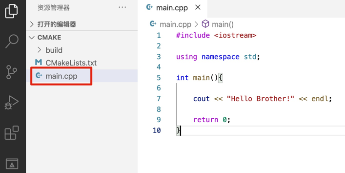
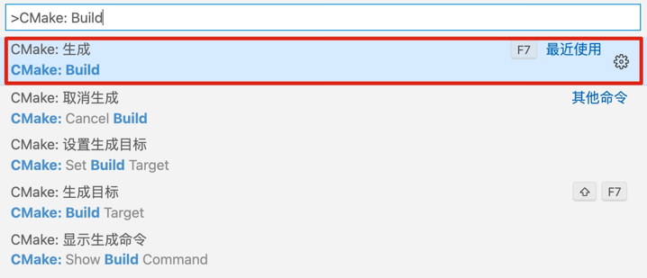

### VS Code 构建简单的 CMake 工程

1. 打开工作区，如图：   
    
   
2. 选择一个文件目录（用来存放 C++ 项目）
3. 新建 `main.cpp` 文件   
    
   
4. 创建 `CMakeListes.txt` 文件
    
如图，最少要有这三个配置
   
5. 打开命令面板，构建   
在 VS Code 左下角，如下图操作：   
   
   
  
6. 执行后，输出如下：
    
   
7. 生成的可执行文件（在 Mac OS 下）   
    
   
8. 打开终端，运行 可执行文件
    

