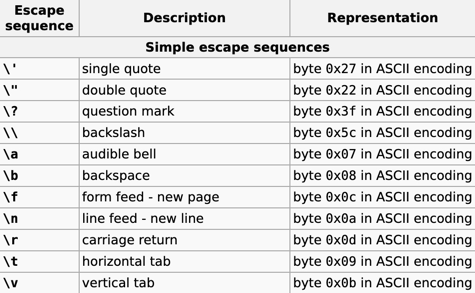

### 基本内置类型
[练习题](../../chapter_2/section_1/Main.cpp)

- 算数类型(arithmetic type) + 空类型(void)
- 类型转换
- 字面值常量

#### 1.算数类型

整型 + 浮点型

##### 整型

- 布尔：bool
- 字符
  - char: 字符(8位)
  - wchar_t: 宽字符(16位)
  - char16_t: Unicode 字符(16位)
  - char32_t: Unicode 字符(32位)
- 其他整型
    - short(16位)
    - int(16位)
    - long(32位)
    - long long(64位)

##### 浮点型

- float: 单精度浮点数，6位有效数字
- double: 双精度浮点数，10位有效数字
- long double: 扩展精度浮点数，10位有效数字

#### 带符号类型和无符号类型

除了 bool 和 扩展的字符型，其他整型可分为：带符号的(signed) 和 无符号的(unsigned)

- unsigned: 只能表示大于 0 的数
- int、short、long、long long 都是带符号的，前面加 unsigned 就是无符号类型了
- unsigned int 可以缩写为：unsigned
- 字符型分三种：char、signed char、unsigned char
    - 但字符的表现形式只有两种：signed char 和 unsigned char
    - char 实际表现为其中一种，具体由哪种编译器决定
  
---

#### 2.类型转换

举例：
```c++
bool b = 42;    // b 为真
int i = b;      // i 的值为 1
i = 3.14;       // i 的值为 3
double pi = i;  // pi 的值为 3.0
unsigned char c = -1; // 假设 char 占 8bit，c 的值为 255
signed char c2 = 256; // 假设 char 占 8bit，c2 的值是未定义的
```
总结：类型所能表示的值的范围决定了转换的过程

---

#### 3. 字面值常量(literal)

如 42 de 值被称作**字面值常量**，这样的值一望而知。

- 每个字面值常量都对应一种数据类型
- 字面值常量的形式和值决定了他的数据类型

小节：
- 3.1 整型和浮点型字面值
- 3.2 字符和字符串字面值
- 3.3 布尔字面值和指针字面值

##### 3.1 整型和浮点型字面值

```c++
20    // 十进制
020   // 八进制 
0x20  // 十六进制 

// 浮点型字面值，表现为一个小数或者以科学计数法表示的指数，指数部分用 E或者e 标识：
3.14159
3.14159E0
0.
0e0
.001
```

##### 3.2 字符和字符串字面值

```c++
'a'   // 字符字面值
"a"   // 字符串字面值（实际上是由常量字符构成的数组）

// 分多行的字符串字面值
std::cout << "how are" 
              "you" << std::endl;
```
**转义序列**（escape sequence）:   
特殊含义的字符，如：单引号、双引号、问好、反斜线



也可以使用泛化的转义序列，反斜杠后面跟数字（数字是字符在字符集中对应的数值）

**指定字面值类型**

方式：在字面值加前缀或者后缀

```c++
L'a'         // 宽字符字面值，类型是 wchat_t
u8"hello"    // utf-8 字符串字面值
42ULL        // 无符号整型字面值，类型：unsigned long long
1E-3F        // 单精度浮点型字面值，类型是 float
3.14159L    // 扩展精度浮点型字面值，类型是 long double
```

##### 3.3 布尔字面值和指针字面值

- bool 字面值是: `true` 或者 `false`
- 指针字面值: `nullptr`


