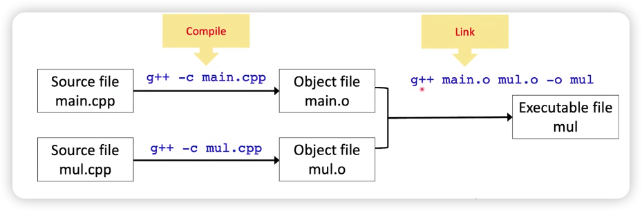
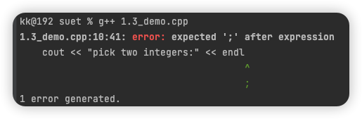
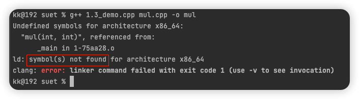
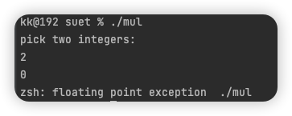

## Compile and Link

- [代码](../../suet/1.3_demo.cpp)


### Function prototypes and definitions

- function prototypes normally are put into head files(*.h; *.hpp)
  - ```c++
     int mul(int a, int b);
    ```
  - function definitions normally are in source files(*.c; *.cpp)
      - ```c++
        int mul(int a, int b){
           return a * b;
        }
        ```
        
### 示意图



### 编译和链接

可以按照上面等示意图，也可以一步到位：
```shell
g++ 1.3_demo.cpp mul.cpp -o mul
```

### Compilation errors



### Link errors



### Runtime errors


