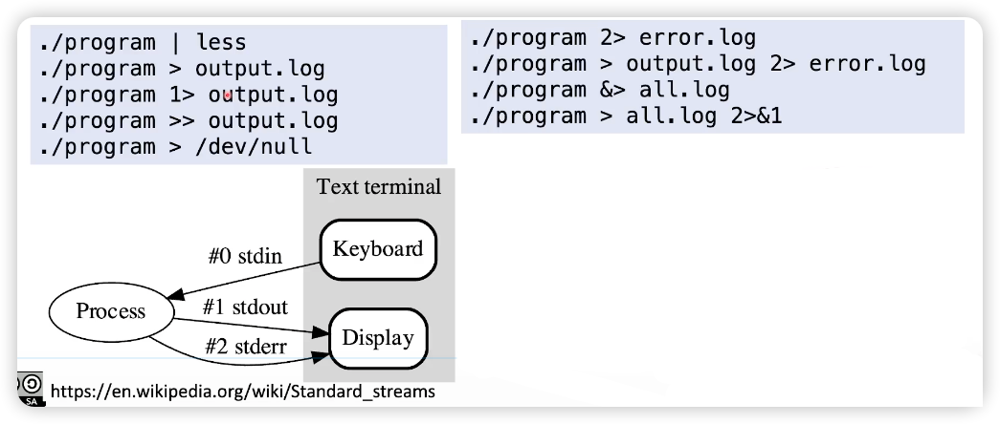

## 14.1 Standard Output Stream and Standard Error Stream

[Code Example](../../suet/chapter14/stderr.c)

### stdin, stdout, stderr

- C语言中，有三个预定义的 text stream，他们的类型都是 `FILE *`
- `stdin`: standard input stream
- `stdout`: standard output stream
- `stderr`: standard error stream

### Output Stream and Error Stream

#### in C
```c
fprintf(stdout, "Info: ...\n", ...);
printf("Info: ... \n", ..,);
fprintf(stderr, "Error: ...\n", ...);
```

#### in Cpp
```c++
std::cout << "Info: ..." << std::endl;
std::cerr << "Error: ..." << std::endl;
```

### Redirection

- 程序的 output 在管道(pipeline)中，而错误输出不再管道中
- 程序的 output 可以被重定向


#### 举例
```shell
# 该操作可以直接把正确的日志输入到 out.log 中，错误的日志输入到 error.log 中
./a.out > out.log 2> error.log

# 把正确日志和错误日志合并到一起. 注意 &> 不是所有的 shell 都支持，bash、zsh 是支持的
./a.out &> all.log
```