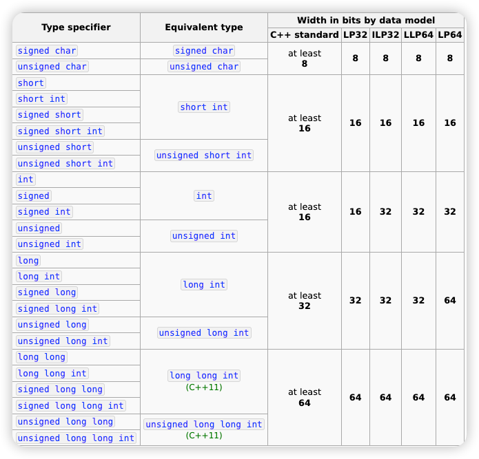

## Integer Numbers

- `int`


### 注意

- Remember to initialize a variable

### int

```c++
int i; // declare a variable
int j = 10; // declare and initialize

int k;
k = 20; // assign a value
```

#### How to initialize

```c++
int num1 = 9;
int num2;
num2 = 10;
int num3(10);
int num4 {10};
```

#### signed and unsigned

if 32-bit
- signed: [-2^31, 2^31 - 1]
- unsigned: [0, 2^32 - 1]

#### Different Data Types for Integer

- `long int`
- `short int`
- `long long`
- 
#### but

- C and C++ standards do not fix the widths of them
  - 没有对这些整型的长度进行固定

#### 不同类型占用 bit 说明
- [来源](https://en.cppreference.com/w/cpp/language/types)



#### sizeof

- It is an operator, not a function!
