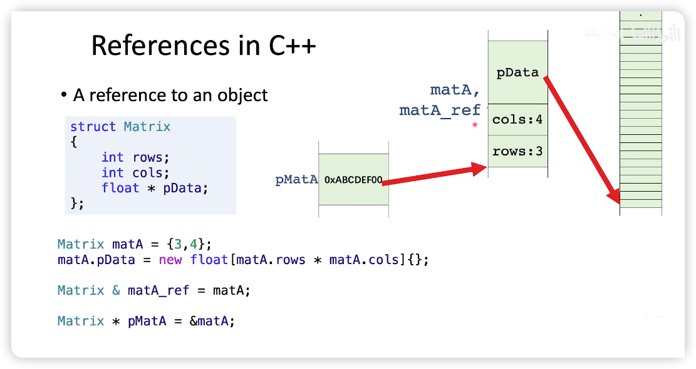

## References in C++

- C++ 中的
- 是已经存在的**变量或对象**的别名
```c++
int num = 0;
int & num_ref = num;
```

### vs Pointer



- 引用必须在声明时就初始化
- 引用更安全

### 引用作为函数参数

- 没有数据copy，效率更高
- 对引用的修改，会影响原始对象
  - 为了防止被修改，可以用 `const` 修饰
