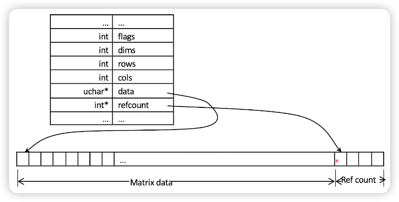
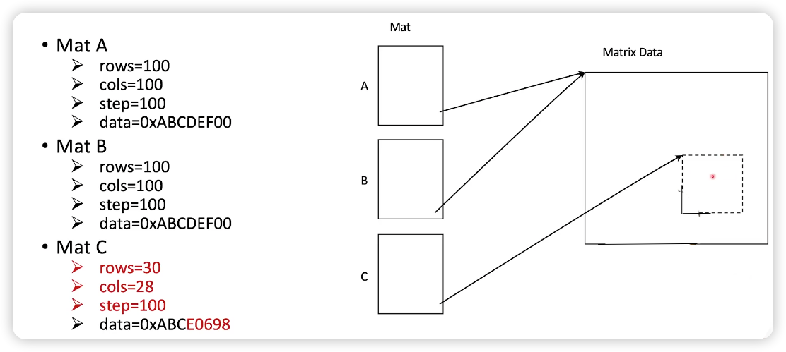

## 8.4 Avoid Memory Copy

以 opencv 里的 Mat 类为例：

- modules/core/include/opencv2/core/mat.hpp
```c++
class CV_EXPORTS Mat {
public:
    int rows, cols;
    uchar* data;
    MatStep step;
    // ...
};
```




### step in cv::Mat

- 每一行矩阵占用多少字节

### ROI

Region of interest
 
