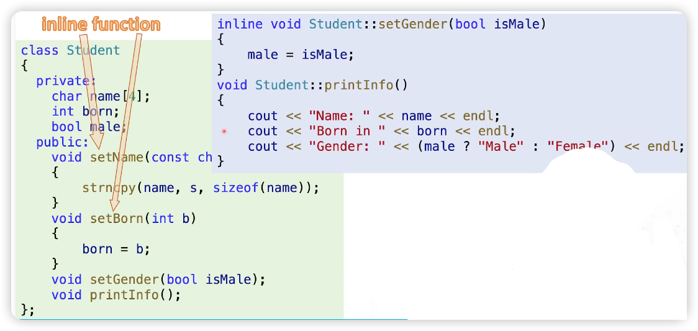

## 9.1 Classes and Objects

### Structures in C

- 包含一系列数据
- 操作结构体的数据容易出错，要非常小心
- 一个比 struct 更好的就是 class

### Classes

#### 潜规则：在类的声明中定义的函数为 inline functions

#### 函数实现放到哪里？

- 简单的函数放到类内部 
- 复杂的函数放到类外部

### [code example](../../suet/chapter9/multi-files/main.cpp)

- 使用 CMake 编译
- 先创建文件夹 build
- ``cd build``
- ``cmake ..``
- ``make``
- 执行编译好的可执行程序